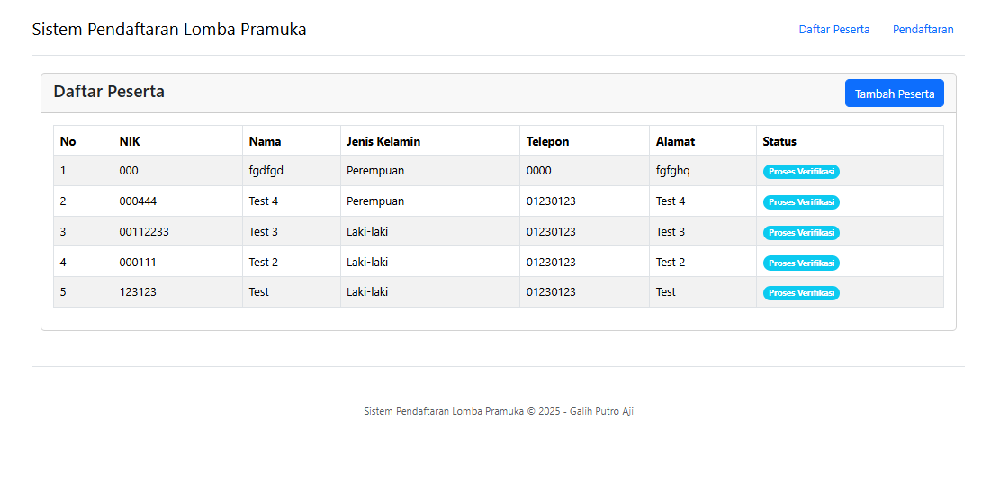
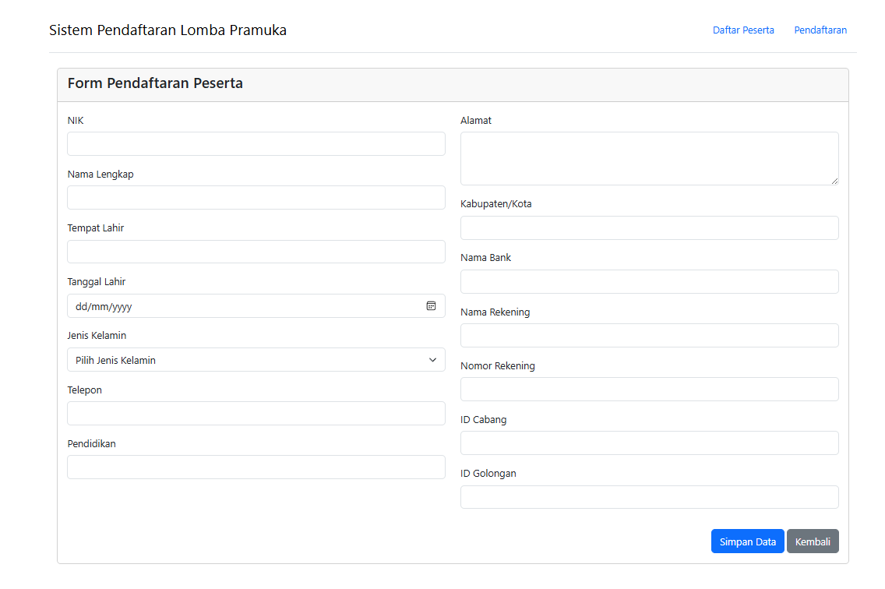

# Sistem Pendaftaran Sederhana

Repository ini merupakan tugas mata kuliah Pemrograman Web.

## Screenshot

## Data Mahasiswa

- **Nama:** Galih Putro Aji
- **NPM:** 1101221174

## Tentang Aplikasi

Aplikasi ini adalah sistem pendaftaran sederhana yang dibuat menggunakan framework CodeIgniter 4. Aplikasi ini memiliki fitur-fitur berikut:

1. Pendaftaran peserta baru
2. Melihat daftar peserta terdaftar
3. Menampilkan status peserta (Proses Verifikasi, Diterima, Ditolak)
4. Validasi data peserta

## Teknologi yang Digunakan

- PHP 8.1+
- CodeIgniter 4
- MySQL Database
- Bootstrap (untuk tampilan frontend)
- JavaScript/jQuery

## Struktur Database

Database menggunakan tabel `peserta` dengan field:

- id (Primary Key)
- nik
- nama
- tempat_lahir
- tanggal_lahir
- jenis_kelamin
- telepon
- pendidikan
- alamat
- kab_kota
- nama_bank
- nama_rekening
- no_rekening
- id_cabang
- id_golongan
- status_peserta
- catatan_verifikasi
- created_at
- updated_at

## Cara Instalasi

1. Clone repository ini
2. Jalankan `composer install` untuk menginstal dependencies
3. Konfigurasi file `.env` dari file `env` dan atur database
4. Jalankan migrasi dengan perintah `php spark migrate`
5. Import data awal dari file `database.sql` (jika diperlukan)
6. Jalankan aplikasi dengan perintah `php spark serve`

## Penggunaan Aplikasi

1. Buka URL aplikasi (<http://localhost:8080>)
2. Navigasi ke menu "Tambah Peserta" untuk mendaftarkan peserta baru
3. Lihat daftar peserta pada halaman utama
4. Status peserta akan berubah warna sesuai dengan statusnya (Diterima/Hijau, Ditolak/Merah, dll)

---

© 2025 Galih Putro Aji - NPM 1101221174
